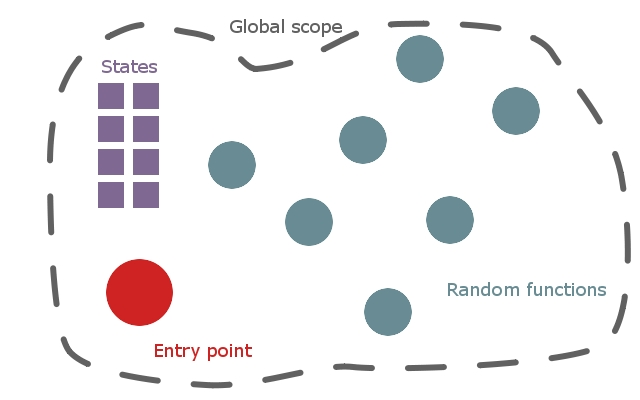

ArtemisAlphonse
===============

"Alphonse" evolution of the Artemis engine library. See the following dev.to
article for more details on context, architecture, etc.:

  https://dev.to/tythos/engines-evolution-10gk

"Alphonse" is a super-basic architecture pattern in which all states and
behaviors exist within the global scope as program-level variables and
functions. This includes the main loop, rendering context, GL configuration,
program/shader variables, vertex buffers... It's all global.

The MSVC solution in the "msvc/" folder is the easiest way to build this
project. You could also build the "main.cpp" from the command line, if you so
desire (or are using a different IDE/compiler). Either way, you will need the
following artifacts at runtime:

* "basic.f.glsl" and "basic.v.glsl" shader source, assumed to exist one folder
  above the runtime directory.

* Dynamic libraries for GLEW and SDL2 (e.g., "glew32d.dll" and "SDL2.dll"),
  assumed to exist within the runtime directory.

Building (with or without the MSVC solution) will require source headers for
GLEW and SDL projects. You will also need static libraries to link against for
both GLEW and SDL projects, as well.
